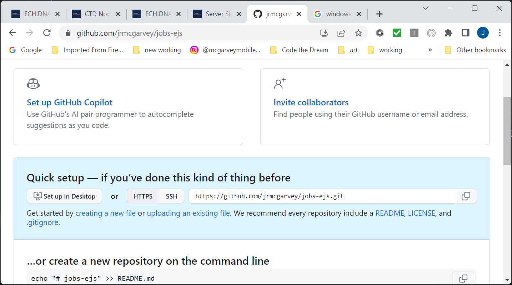
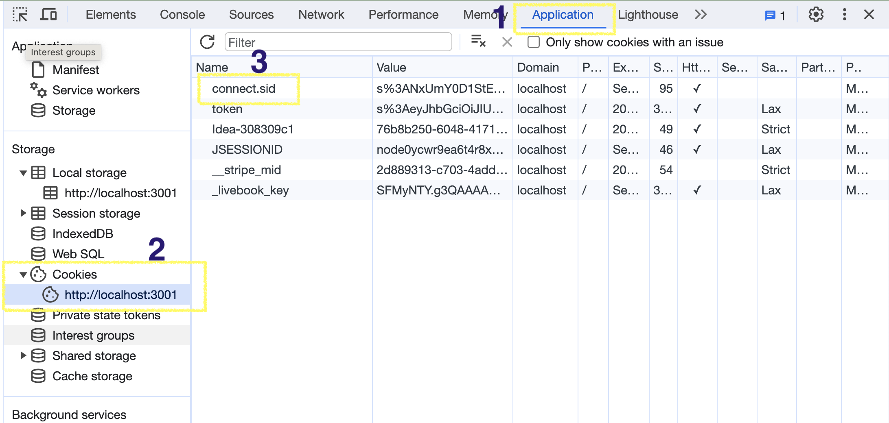

---     
layout: "../../layouts/genericMarkdownFile.astro"     
title: "Lesson 12: Server Side Rendering with EJS"     
description: "imported from WordPress,Lesson 12: Server Side Rendering with EJS"     
---

# Lesson 12: Server Side Rendering with EJS

## **Lesson Materials**

In this lesson, you learn `EJS` (Embedded Javascript), a templating language for Express. The templates contain embedded JavaScript, which is executed on the server side. This constructs an ordinary HTML page, but with dynamic content. Because the embedded JavaScript runs on the server, before the page is sent to the client, dynamic content can be delivered, such as information from a database. This is called “server-side rendering”. Except for the embedded JavaScript, the templates are ordinary HTML pages, which may be combined with CSS and client-side JavaScript.

Server-side rendering is in some respects easier than writing first an API and then a front end for it, where the front end makes fetch calls to the API. On the other hand, if you don’t create an API, you can’t access the data via React or other front ends that run outside the application itself. There are other advantages and disadvantages. Frequently, an application will use both methods, using server-side rendering for the administrator user interface and front-end/back-end for the end-user interface.

In EJS, there are really only three kinds of embedded JavaScript statements:

```
<%- include 'filename' %>
<% code %>
<%= code %>
```

All are encased in the `<% %>` sequence.

The one with the minus in front does an “include” of another template, so that you can have headers, footers, and other partials.

The one with no minus or equals sign executes code but does not return any change to the HTML. This is used for logic statements, such as `if` statements and `for` loops.

The one with the equals sign executes code and returns the result in line as HTML.

---

Please be sure that you understand where each piece of JavaScript executes!

The JavaScript for your controllers, routes, middleware, etc. executes on the server side. If you do a `console.log` for this code, it appears in the server terminal. The code you put into an EJS file also executes on the server side, to customize the page with variable data before it is sent to the browser.

However, you can also put JavaScript into an HTML or EJS page, or load it from a script, where the JavaScript is _not_ within the EJS `<% %>` enclosure. That JavaScript is loaded by the browser and runs in the browser context, which means that it has access to the window and the DOM, but it does not have access to server side data and the database. Anything logged by `console.log` in thatcase would appear in the browser DevTools console.

## **Assignments**

### Coding Assignment

In this project (which continues for the next 3 lessons), you create a jobs application an alternate way from the previous session. This time, using server-side rendering with the `EJS` templating language. If you haven’t started your final project, you can use this project as the basis, using server-side rendering instead of the front-end + back-end model. Of course, to satisfy the requirements of the rubric, you would need to modify the schema to manage objects that are different from the jobs model.

### Creating the Repository

There is no starter repository for this project, so you will need to create one, with the following steps. First, create a `jobs-ejs` folder/directory on your computer (not in the tree of a previous project), and `cd` (change directories) into it. **Make sure that it is not in the tree of a previous project, that is, running `git status` _should_ return an error after you create the directory**. Next, create the `.gitignore` file and the `.env` file. The `.gitignore` file is critical to make sure your Mongo credentials and the Node libraries are not stored in Github. It should have these lines:

```
/node_modules
.env
.DS_Store
```

You can just copy the `.gitignore` file and the `.env` file from the `06-jobs-api` directory. You won’t use the JWT values from `.env`, so you can delete those. The `.env` file is needed for the Mongo credential, and eventually for the session secret.

Next, run `git init` to make the directory a git repository. Then, log into Github and create a new repository called `jobs-ejs`. You create a new repository using the + button in the upper right of your Github screen. You do not use a template, the repository should be public, and you do not create a `README` or a `.gitignore`.


Once the repository has been created, you need to associate the Github repository with the repository on your laptop. You will see the following screen:



Click on the clipboard icon next to the URL to copy it. Then, in your laptop session for the jobs-ejs repository, type the following, where the URL is the one you copied to your clipboard

```
git remote add origin <paste URL here>
git add -A
git commit -m "first commit"
git push origin main
```

The local repository is now associated with your Github repository. There isn’t much in it yet, just the `.gitignore`. Now create the `lesson12` branch, where you will do your work.

### Components and Directories

You need to initialize NPM for your repository. So, do an `npm init`. You can take all the defaults when prompted. This creates the `package.json`, and enables the installation of npm packages. You need to add `scripts` for dev and start to the `package.json` so that you can do `npm run` or `npm run dev`, where the `dev` script runs app.js using `nodemon` and the plain `npm run` runs it using `node`.

You need to install the following packages:

```
bcryptjs
connect-flash
connect-mongodb-session
cookie-parser
dotenv
ejs
express
express-async-errors
express-rate-limit
express-session
helmet
host-csrf
mongoose
passport
passport-local
xss-clean
```

You should also install `eslint`, `prettier`, and `nodemon` as **dev dependencies** if you haven’t installed them globally. You’ve seen some of these packages before, but not others. Each will be explained as we use them.

You will write to the Mongo database, so to save time, you can copy two directory trees from the `06-jobs-api` directory. You can use the following commands (you may have to adjust these depending on your directory structure / where you’ve set up your folders):

```
cp -r ../06-jobs-api/db .
cp -r ../06-jobs-api/models .
```

Now create the directory structure you will use, in particular the following directories:

```
controllers
routes
middleware
utils
views
views/partials
```

You do not need a `public` directory. The pages are rendered by the `EJS` engine from the `views` directory.

Next, create the boilerplate `app.js`. It should look as follows:

```
const express = require("express");
require("express-async-errors");

const app = express();

app.set("view engine", "ejs");
app.use(require("body-parser").urlencoded({ extended: true }));

// secret word handling
let secretWord = "syzygy";
app.get("/secretWord", (req, res) => {
  res.render("secretWord", { secretWord });
});
app.post("/secretWord", (req, res) => {
  secretWord = req.body.secretWord;
  res.redirect("/secretWord");
});

app.use((req, res) => {
  res.status(404).send(`That page (${req.url}) was not found.`);
});

app.use((err, req, res, next) => {
  res.status(500).send(err.message);
  console.log(err);
});

const port = process.env.PORT || 3000;

const start = async () => {
  try {
    app.listen(port, () =>
      console.log(`Server is listening on port ${port}...`)
    );
  } catch (error) {
    console.log(error);
  }
};

start();
```

This boilerplate has crude page not found handling, as well as error handling. Those functions will be moved to middleware eventually. It also has something mysterious to handle the `/secretWord` route. So, if you run this app as is, it will return page not found for all URLs, except for `/secretWord`. That one returns an error — because we haven’t created the secretWord view! Once we have created the view, the `res.render` operation will display it. Note that we also need an `app.use` statement for the body parser.

## First EJS file

Create `views/secretWord.ejs`. The file should look as follows:

```
<!DOCTYPE html>
<html lang="en">
  <head>
    <meta charset="UTF-8" />
    <meta http-equiv="X-UA-Compatible" content="IE=edge" />
    <meta name="viewport" content="width=device-width, initial-scale=1.0" />
    <link
      href="https://cdn.jsdelivr.net/npm/bootstrap@5.2.2/dist/css/bootstrap.min.css"
      rel="stylesheet"
      integrity="sha384-Zenh87qX5JnK2Jl0vWa8Ck2rdkQ2Bzep5IDxbcnCeuOxjzrPF/et3URy9Bv1WTRi"
      crossorigin="anonymous"
    />
    <title>Jobs List</title>
  </head>
  <body>
    <p>The secret word is: <%= secretWord %></p>
    <p>Would you like to change it?</p>
    <form method="POST">
      <label name="secretWord"></label>
      <input name="secretWord" /><br />
      <button>Submit</button>
    </form>
  </body>
</html>
```

This is an EJS file, but it looks just like HTML — except that section in `<%= %>`. Enclosed in those tags is JavaScript that is executed on the server side to modify the template. In this case, it just inserts the value of the `secretWord` variable. This value is passed to the EJS file via the second argument of the `res.render` function call in `app.js`.

**Keep in mind** that the value must be a string or something that JavaScript knows how to convert to a string with a `toString()` method. If you try to pass in an object or some other complex data structure, you’ll likely just see it rendered as `[object Object]`. One way to handle that case would be to use the `JSON.stringify(object)` function to convert an object into a string.

Note also that the `POST` operation does a `redirect`, telling the browser which URL should be displayed after processing is complete. This ends up calling `GET /secretWord` again, this time displaying the updated `secretWord` value.

Try opening the <http://localhost:3000/secretWord> URL. You should see that the secret word is displayed, and it can be changed.

If the application has a lot of boilerplate, headers and footers and so on, we don’t want to have to duplicate that for every page. So we use “partials”. Create the following files:

`views/partials/head.ejs`

```
<!DOCTYPE html>
<html lang="en">
  <head>
    <meta charset="UTF-8" />
    <meta http-equiv="X-UA-Compatible" content="IE=edge" />
    <meta name="viewport" content="width=device-width, initial-scale=1.0" />
    <title>Jobs List</title>
  </head>
  <body>
```

`views/partials/header.ejs`

```
<h1>The Jobs EJS Application</h1>
<hr />
```

`views/partials/footer.ejs`

```
<hr>
<p>A copyright could go here.</p>
</body>
</html>
```

Then change `views/secretWord.ejs` to substitute include statements, so that the whole thing reads:

```
<%- include("partials/head.ejs") %>
<%- include("partials/header.ejs") %>
  <p>The secret word is: <%= secretWord %></p>
  <p>Would you like to change it?</p>
  <form method="POST">
    <label name="secretWord"></label>
    <input name="secretWord" /><br />
    <button>Submit</button>
  </form>
<%- include("partials/footer.ejs") %>
```

You use the `<%- %>` to include HTML from other files. Be sure that you only use it with HTML that you trust, otherwise you could introduce a security exposure. Try the new page out.

The data we are displaying is just the _value_ of the `secretWord` variable — but we could also insert data into the page that was retrieved from the database, as we’ll see.

### Sessions

There are a couple problems with the handling of the secret word. First, the value is stored globally — so every user sees the same value. We want the user to see only their own data. The second problem is that the data is stored in the memory of the server process, so when that server is restarted, the value is lost. We fix this using sessions. (Sessions may also be used with front-end+back-end applications.)

Sessions are associated with a cookie, as we’ll see, and they are protected with a secret. So add a line to `.env` with this secret, as follows:

```
SESSION_SECRET=123lkawjg091u82378429
```

The secret is some hard to guess string — and you **_never_** want to publicize it to Github! Then, add the following lines to `app.js`. These lines should be added _before_ any of the lines that govern routes, such as the `app.get` and `app.post` statements:

```
require("dotenv").config(); // to load the .env file into the process.env object
const session = require("express-session");
app.use(
  session({
    secret: process.env.SESSION_SECRET,
    resave: false,
    saveUninitialized: true,
  })
);
```

Change the logic so that the secret word is stored and retrieved in the session, as follows:

```
// let secretWord = "syzygy"; <-- comment this out or remove this line
app.get("/secretWord", (req, res) => {
  if (!req.session.secretWord) {
    req.session.secretWord = "syzygy";
  }
  res.render("secretWord", { secretWord: req.session.secretWord });
});
app.post("/secretWord", (req, res) => {
  req.session.secretWord = req.body.secretWord;
  res.redirect("/secretWord");
});
```

`req.session` is an object that will persist across requests.

Then try the <http://localhost:3000/secretWord> URL. You will see that it works as before, except that if you have different sessions (from different browsers; or from a regular tab and an incognito tab) the value of the secretWord is different. However, if you restart the server, the value is lost. This is because while we’re no longer storing `secretWord` as a global variable, it is still being stored in the memory of the server.

If you go into developer tools in your browser, and click on the `Application` tab, you can check that a cookie with the name of `connect.sid` has been associated with your browser session.



This is the key used to retrieve session data. You can also see that the `HttpOnly` flag is set, so that browser-side code can’t access this cookie.

We want to store the session data in a durable way. To do this, we’ll use Mongo as a session store. Replace the one line that does the `app.use` for session with all of these lines:

```
const MongoDBStore = require("connect-mongodb-session")(session);
const url = process.env.MONGO_URI;

const store = new MongoDBStore({
  // may throw an error, which won't be caught
  uri: url,
  collection: "mySessions",
});
store.on("error", function (error) {
  console.log(error);
});

const sessionParms = {
  secret: process.env.SESSION_SECRET,
  resave: true,
  saveUninitialized: true,
  store: store,
  cookie: { secure: false, sameSite: "strict" },
};

if (app.get("env") === "production") {
  app.set("trust proxy", 1); // trust first proxy
  sessionParms.cookie.secure = true; // serve secure cookies
}

app.use(session(sessionParms));
```

These lines cause the session to be stored in Mongo. The bit about `sessionParms.cookie.secure = true` is important but may not be immediately obvious. It is saying that, if the application is running in production, the session cookie won’t work unless SSL is present. It’s a good policy, but as you are not running in production, you don’t have SSL.

Then try the app again. Now you see that the `secretWord` value is preserved even if the server is restarted. If you go to your Mongo database, you can see the session data there — although it is not human-readable.

### Flash Messages

As the user performs operations, you need to inform them of the result. You do this with the `connect-flash` package. This stores the result of operations so that they can be subsequently displayed to the user. This information can’t be kept in server storage, because otherwise each user could see the others’ messages. And it can’t be stored in the req or res objects, because after an operation, there is typically a redirect, and the information would be lost. Therefore, the `connect-flash` package relies on the _session_. The package also keeps track of whether the message has already been displayed, so that it is only shown once. You can store multiple messages at different severity.

Add the following code. Note that this code must come after the `app.use` that sets up sessions, because flash depends on sessions:

```
app.use(require("connect-flash")());
```

We want to set some messages into flash. To do this, change the `POST` route for `/secretWord` to look like this:

```
app.post("/secretWord", (req, res) => {
  if (req.body.secretWord.toUpperCase()[0] == "P") {
    req.flash("error", "That word won't work!");
    req.flash("error", "You can't use words that start with p.");
  } else {
    req.session.secretWord = req.body.secretWord;
    req.flash("info", "The secret word was changed.");
  }
  res.redirect("/secretWord");
});
```

These messages should be displayed on the next screen. Note that you can have multiple info or error messages. In order for them to be displayed, we need to add code in the view, in the `header.js` partial template, as follows:

```
<h1>The Jobs EJS Application</h1>
<% if (errors) {
  errors.forEach((err) => { %>
    <div>Error: <%= err %></div>
<% }) } %>
<% if (info) {
  info.forEach((msg) => { %>
    <div>Info: <%= msg %></div>
<% }) } %>
<hr />
```

Whoa! you may be saying. That doesn’t look like HTML! What will the browser do with it? The answer is that the browser never sees this stuff. The things in `<% %>` are JavaScript, executed on the server side, and the render process removes this and replaces it with the result of the code. There is logic, which is executed but not displayed, in the `<% %>` parts. Then, there is substitution of values, in the `<%= %>` parts, where the equals sign indicates that a value is to be displayed. So, this code checks the `info` and `errors` arrays, displaying values from them if any are present.

But, the problem is that the `info` and `errors` arrays need to get passed into the EJS file, when the render is called. This could be done as follows:

```
res.render("secretWord", {
  secretWord,
  errors: flash("error"),
  info: flash("info"),
});
```

But this is a little clumsy, because if we have a bunch of pages we render, every render statement would have to be modified. So, instead, we put the values in `res.locals`. That hash contains values that are always available to the EJS rendering engine. As follows:

```
app.get("/secretWord", (req, res) => {
  if (!req.session.secretWord) {
    req.session.secretWord = "syzygy";
  }
  res.locals.info = req.flash("info");
  res.locals.errors = req.flash("error");
  res.render("secretWord", { secretWord: req.session.secretWord });
});
```

This is how `res.locals` is loaded with the right stuff. However, we’d want to move the `res.locals` statements into a middleware routine that always runs (_after_ the flash middleware, but _before_ any of the routes), and we’ll do that eventually.

### Submitting Your Work

To submit your work, you add, commit, and push your branch as usual, create a pull request and include a link to your pull request in the homework submission. In the next lesson, we will implement authentication using Passport, and in the final lesson, we’ll manage Jobs entries in the database.

### Mindset Assignment

Your mindset assignment for this week can be found here: **[Accessibility](https://learn.codethedream.org/mindset-curriculum-accessibility-a11y/)**

**Submitting Your Work**

**When you’ve completed your Coding Assignment and Mindset Assignment this week, submit all of your work using:**

[**Homework Assignment Submission Form**](https://airtable.com/shrBpqHbS6wgInoF9)