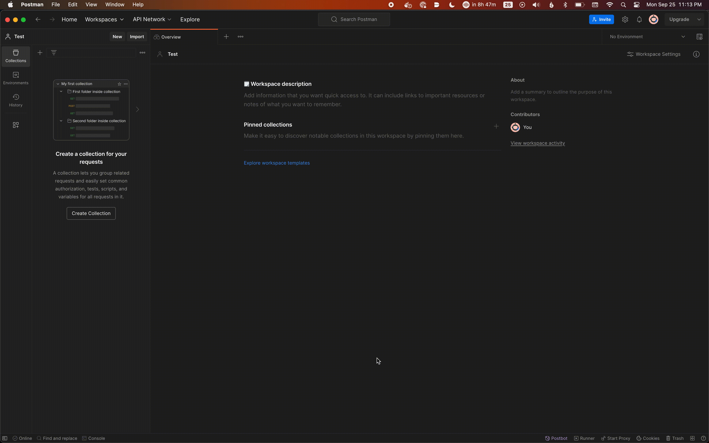
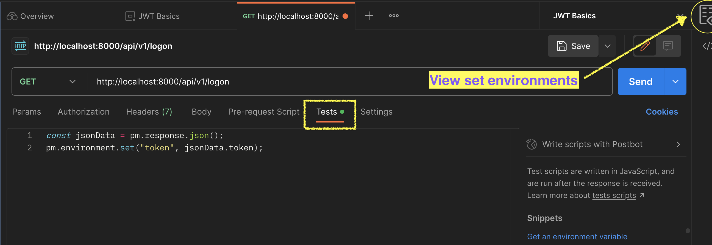

---     
layout: "../../layouts/genericMarkdownFile.astro"     
title: "Lesson 8: JWT Basics"     
description: "imported from WordPress,Lesson 8: JWT Basics"     
---

# Lesson 8: JWT Basics

## **Lesson Materials**

### Concepts: Authentication with JWT Tokens

When you deploy a web application that allows users to create entries in a database, you typically need to protect that application with some form of authentication. Each user registers with the application, specifying a user identifier and a password. This information is stored by the application, typically in a database. If the application stores this information in MongoDB, you will have a User model. The model stores the user ID, a hash of the password, and perhaps other information. **The password itself is never stored, because that would make the application a risky repository of user passwords.** Instead, a **cryptographic hash** of the password is stored, and this information allows the user password to be validated at logon time, without needing to actually store the password itself.

When the user logs in, the front end of the application needs to store a credential for use in subsequent requests — otherwise the user would have to log in for every protected request. One type of credential that is often used for REST requests is a JSON Web Token (JWT). The token is cryptographically signed by the server, using a secret string that’s only known by the server, so it can’t be counterfeited. The token contains information about which user is logged in. The token is not human-readable, but it is not encrypted either, so you should never put sensitive information in it, especially not the password or password hash. When the user is registered in MongoDB, a unique ID is created, just as it is for every MongoDB entry. This ID is typically stored in the token.

### A Comment On Security

The way the instructor uses the JWT is as follows: (1) The user logs in with id and password, and the JWT is returned in the body of the response. (2) The web front end stores the JWT in local storage. (3) In subsequent requests, the JWT is inserted by the front end as a Bearer token in the `Authorization` header, so that it can be validated and so that the back end knows which user is making the request. You can see an example of this in the public directory for this assignment. This is a common practice — and a **very bad one!** You should never store sensitive information in the browser’s local storage. This is because, especially in large and complicated web front ends, it is common to introduce a vulnerability to a security attack called cross site scripting (XSS). If the application has an XSS vulnerability anywhere, the attacker can capture the token from local storage, and can then reuse that token to impersonate the user, doing any operations the user can do.

So, if you can’t put the token in local storage, how can you keep it on the browser side to maintain a logged on user session? The way this is done is for the server to set an HTTP-only cookie for the user session. The cookie is stored by the browser, but it is inaccessible to JavaScript in the browser session. When the front end sends a `fetch()` request to get data, the `fetch()` is performed with either `credentials: 'include'` or `credentials: 'same-origin'`. This causes the cookie to be sent back to the back end for validation.

But, there is one more hitch. When a cookie is used, an attacker can then do cross site request forgery (CSRF), another security attack where the attacker leverages the fact that the cookie is automatically sent with a form post. So, one must add protections for CSRF, such as that provided by [this package](https://www.npmjs.com/package/host-csrf). we’ll use that package later in the course.

For the next few assignments, you will follow the approach the instructor recommends — but do not do it in a production application! Actually, the approach where the caller saves the JWT for use in the authorization header is fine, but only when one server is talking to another. In that case, the calling server can store the JWT without using browser local storage.

### Protecting Routes

To protect routes in your Express application, you create authentication middleware, which runs before the route handler for each protected request. The authentication middleware checks that the token is present with the HTTP request, typically as the Bearer token in the `Authorization` header. Then it validates the token cryptographically, making sure the signature matches the secret. Then, it stores the user ID and perhaps other information about that user in the `req.user` property as a hash/object, so that it can be used by the controller functions handling each request. For example, this allows you to write a controller function that returns only the information that the logged on user is authorized to see.

Some routes are not protected by the authentication middleware, including in particular the logon route and registration routes and any other pages we want all users to be able to see whether or not they are logged in.

Cryptography is complicated, and you shouldn’t try to do your own. In this assignment, we use the `jsonwebtoken` [npm module](https://www.npmjs.com/package/jsonwebtoken) to create the tokens (at logon time) and to validate tokens (in the middleware of authenticated routes). For this lesson, we won’t store the user information, which means that the user is not registered and the password is not validated. (We’ll do that in a later lesson.) Instead, the user enters an ID and password and a JWT token is created. Then the token is used to access the protected route.

### Concepts: Error Handling

The instructor shows how to throw errors, such as authentication errors, and how to handle them in an error handler. The elements of error handling are as follows:

* The `express-async-errors` package is installed. It will catch errors thrown in your controllers and send them on to the process error handler. This prevents you from having to write `try...catch` blocks in all of your controllers.
* A `StatusError` class that can be instantiated when an error occurs. This class should extend the built-in `Error` class. It should have a constructor that takes two parameters, (1) the error message and (2) a number that is the HTTP status code.
* Error handling middleware. This is called as a result of an `app.use()` statement that appears after all of your routes. It must be declared with four parameters, which are named `err`, `req`, `res`, and `next`.

The error handler has to return something to the caller, as otherwise the caller would just hang indefinitely waiting on the HTTP response. So it returns an appropriate HTTP result code, along with a descriptive error message. As this is an API, the error message is returned as JSON. If there is an error in your code, the error handler is invoked. Some errors are expected, and in this case the error handler can return a descriptive error message and an appropriate HTTP result code to the caller. For example, you might have a validation error when creating or updating an entry. In your error handler, you need to parse the validation error to get a useful error message, such as how one or several attributes failed the validation. Authentication errors are also expected, for example when the user enters an invalid email or password when logging in. “Cast” errors can occur if the request includes an ID that is not a valid Mongo object ID, so this is an expected error and you can return a 404\. Please look at the instructor’s code to see how these cases are handled.

But some errors are not expected — that is, if your code is working right, they should never occur. An example is a variable reference error caused by a code bug. For these, it is not a good idea to give the original error message back to the user, as it is not friendly and it discloses code internals. So you return a message such as “A server error occurred.” with a 500 result code, and you also do a console log of such errors, so that you can find the bug. The instructor does not do this logging, but he should.

The `StatusError` class could look like this:

```
class StatusError extends Error {
  constructor(message, resultCode) {
    super(message);
    this.statusCode = resultCode;
  }
}
```

Using this class, if your authentication middleware finds that the JWT token is missing or invalid, you can just throw the error as follows:

```
throw new StatusError(
  "The request was not authenticated",
  StatusCodes.UNAUTHORIZED
);
```

Then you add appropriate code to the error handler to handle this case, sending back the status code and an appropriate JSON message to the caller.

## Continuing with the Video

The video instruction for this lesson starts at 5:05:30 of **[this video](https://youtu.be/rltfdjcXjmk?t=18325)** and continues to 6:28:35.

## **Assignments**

We want to give you an opportunity to get creative and to do your own work, so for this assignment, you should try creating your own Express applications. If you don’t feel comfortable doing this yet, you can just emulate the instructor in the video as before. For either assignment, please complete the section at the bottom of this page on how to automatically save the authentication token in Postman.

### Preferred Coding Assignment

You continue to work in the `node-express-course` repository. For this lesson, you work in the `05-JWT-Basics` directory. Create a new branch, `week8`. **This branch should be created when the `week7` branch is active**. Create a folder called `preferred` inside the `05-JWT-Basics` directory. Inside that folder, create an Express application. You’ll need to do an `npm init` inside that folder (you can accept all the defaults), and you’ll need to `npm install` the `express`, `jsonwebtoken`, and `dotenv` packages. You also need to create a `.gitignore` file with `.env` and `/node_modules` as lines in that file. Follow best practices in organizing this application: you should have an `app.js` and then, in separate directories, your routes, middleware, and controllers. (You only need one file in each of these folders for this assignment.)

You’ll need to call two functions from the `jsonwebtoken` package. The functions are documented [here.](https://www.npmjs.com/package/jsonwebtoken) The functions you need are `jwt.sign` (to create the token) and `jwt.verify` (in your authentication middleware). Ideally you would use the asynchronous forms of these functions, with a callback for each, but if that sounds too complicated, just use the synchronous forms. If you use the synchronous calls, be sure that you do a `try/catch` for the `jwt.verify()`, as it will throw an error if the token isn’t valid.

The application should have two routes, a `POST` for `/api/v1/logon`, and a `GET` for `/api/v1/hello`. The `POST` request takes a JSON body with two attributes, `"name"` and `"password"`. It returns a 200 (`OK`) return code and a JSON object with one attribute, a `"token"`, which is the JSON web token. You’ll need a secret (which is a long, hard-to-guess string) and a lifetime, which should be “24h”. These values should be read out of a `.env` file using the `dotenv` package. You should store the user’s name inside the token.

You will protect the `GET` request by a middleware authentication function. This checks the `Authorization` header. You get that by doing `req.header("Authorization")`. This should be a string starting with `"Bearer "` (note the space after the word ‘Bearer’) and followed by a string of random characters. You take the random part of the string (using the `split()` function) and validate the token. If the token is not present or not valid, you return a 401 (unauthorized) status code and a JSON object that has one attribute, “message” with the value “unauthorized”. (You don’t call `next()` in this case, because we don’t want to proceed to the controller function.) If the token is present and valid, the middleware gets the user’s name from the token payload. Then it creates a hash with one key “name” and a value being the user’s name, and you save it in `req.user`. Then call `next()` to pass control to the controller for the GET request.

That controller should return a 200 response code and a JSON object that has one attribute, “message”, with some message to the user that includes the user’s name (from `req.user.name`).

Test your application with Postman. What you test for the `POST` request should be straightforward. But if you try the GET request, you should get back “unauthorized”. To test a successful GET request, you have to configure the authorization for that request in Postman. First do the POST request. You’ll get back a token. Copy the token to the clipboard. Then go to the GET request and click on Authorization. Select Bearer and paste in the token. Save the request. Then send it. You should get back the message with your user’s name.

Optionally, you could create a simple HTML and JavaScript front end for the application in a preferred/public directory. The front end would have a login form, and would make a fetch or axios request to the back end API to do the login, saving the resulting token in local storage. Then it would send another fetch or axios request to the back end, with a Bearer token in the authorization header, to get the hello message, displaying the result to the user. This is only a few lines of work, and you can look at the video instructor’s example.

### Alternate Coding Assignment

This is only in case you aren’t confident that you can complete the preferred coding assignment. You continue to work in the `node-express-course` repository. For this lesson, you work in the `05-JWT-Basics/starter` directory. Create a new branch, `week8`. **This branch should be created when the `week7` branch is active**. Then run `npm install` to install the required node packages. Duplicate the steps that the instructor performs, testing with Postman as you go. There are two routes to test, a `POST` route to `/api/v1/login`, and a `GET` request, to `/api/v1/dashboard`. For the `GET` request, you have to configure the authorization for that request in Postman. First do the `POST` request and copy the token to the clipboard. Then go to the `GET` request and click on `Authorization`. Select `Bearer` and paste in the token value. Then save the request and try it.

### Saving the Token Automatically in Postman

This is a little complicated, but you should learn to do it for use in future assignments. First click on New in the upper left, and select Environment. Set the title to JWT Basics. Then on the upper right, click on Environments and set it to JWT Basics, to make that environment active.

  
_(right-click and open image in a new tab to see it a little larger)_

Now open up the POST request for logon. Click on tests. Then enter the following code:

```
const jsonData = pm.response.json();
pm.environment.set("token", jsonData.token);
```



This code reads the `"token"` attribute from the response JSON and saves it in the “token” environment variable that you created earlier. Then save and run the logon request. There is an icon on the upper right with an eye on it. This gives you a look at the environment. You should see the token in the environment.

Next, open the `GET` request authorization again. Click on authorization, Bearer. This time, for the token value, put `{{token}}`. This uses the token variable from the environment. Then save and run the request. It should work as before.

### **Mindset Assignment**

Your mindset assignment for this week can be found here: **[Willingness to Experiment](https://learn.codethedream.org/mindset-curriculum-willingness-to-experiment/)**

**Submitting Your Work**

**When you’ve completed your Coding Assignment and Mindset Assignment this week, submit all of your work using:**

[**Homework Assignment Submission Form**](https://airtable.com/shrBpqHbS6wgInoF9)